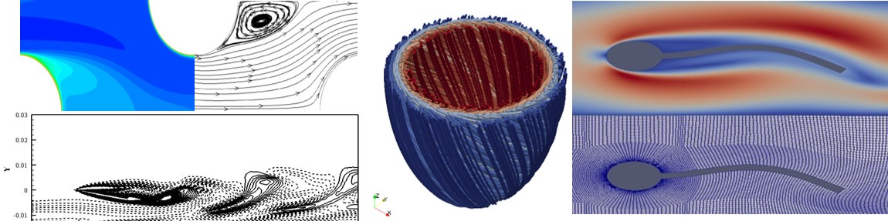

### Hi there 👋
I am a joint PhD student at the University of Queensland and Indian Institute of Technology Delhi.  
My PhD research is on simulations to understand ventricular mechanics of heart failure preserved ejection fraction (HFpEF).  
My research interest spreads over computational cardiac mechanics, computational fluid dynamics, fluid-structure interaction, lattice Boltzman method, heat transfer, FVM, FEM and lumped parameter modeling

#### Connect with me

 
  
  

<!--
**jijoderick/jijoderick** is a ✨ _special_ ✨ repository because its `README.md` (this file) appears on your GitHub profile.

Here are some ideas to get you started:

- 🔭 I’m currently working on ...
- 🌱 I’m currently learning ...
- 👯 I’m looking to collaborate on ...
- 🤔 I’m looking for help with ...
- 💬 Ask me about ...
- 📫 How to reach me: ...
- 😄 Pronouns: ...
- ⚡ Fun fact: ...

-->
